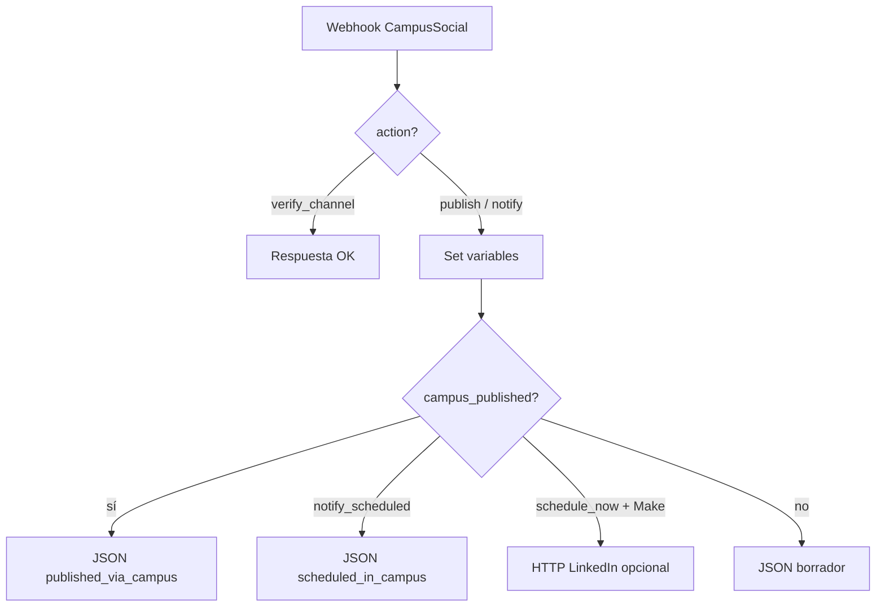

# Importar el blueprint de CampusSocial en Make.com

Archivo: **`CampusSocial_LinkedIn_Make.blueprint.json`**

Equivalente al flujo n8n `CampusSocial _ Publicación LinkedIn.json`, adaptado a **LinkedIn únicamente** y al contrato de CampusSocial (Cloud Functions → webhook).

---

## 1. Importar el blueprint

1. En Make: **Scenarios** → **Create a new scenario**.
2. Menú **⋯** (arriba a la derecha) → **Import blueprint**.
3. Elige `CampusSocial_LinkedIn_Make.blueprint.json` → **Save**.
4. Si ves **Module Not Found**, usa el blueprint actualizado (`gateway:CustomWebHook` con H mayúscula) o lee **`ARREGLAR_ESCENARIO_MAKE.md`**.
5. Tras importar, **crea el webhook** en el primer módulo (Add → Create a webhook); sin eso no guarda bien.

---

## 2. Configurar el webhook

1. Abre el módulo **Webhooks → Custom webhook** (primer módulo).
2. **Create a webhook** → copia la URL (`https://hook.eu1.make.com/...`).
3. En CampusSocial → **Ajustes** → **Automatización Make** → pega la URL → **Guardar**.

### Secreto (recomendado)

En `Backend/.secret.local`:

```env
MAKE_WEBHOOK_URL=https://hook.eu1.make.com/xxxxxxxx
MAKE_WEBHOOK_SECRET=un-secreto-largo-aleatorio
```

En Make, en la **línea de conexión** entre el webhook y el router, añade un **filtro**:

- Campo: `X-Campus-Secret` (cabecera del webhook; activa *Get request headers* en el webhook si no la ves).
- Operador: igual a
- Valor: el mismo `MAKE_WEBHOOK_SECRET`

---

## 3. Variables del escenario

**Scenario settings** (engranaje del escenario) → **Variables**:

| Variable | Ejemplo | Uso |
|----------|---------|-----|
| `linkedinAuthorUrn` | `urn:li:person:AbCdEf` | Autor del post (tu perfil o página) |
| `telegramChatId` | `-1001234567890` | Solo si usas notificaciones Telegram |

Obtén el URN en [LinkedIn Developers](https://www.linkedin.com/developers/) o desde CampusSocial tras conectar OAuth (campo `memberUrn` en el servidor).

---

## 4. Conexión LinkedIn (publicar)

El blueprint usa **HTTP → POST** `https://api.linkedin.com/v2/ugcPosts`.

**Opción A (recomendada en Make):** sustituye los módulos HTTP (ids 8 y 9) por:

- **LinkedIn → Create a User Text Post** (solo texto)
- **LinkedIn → Create a User Image Post** (si hay `image_url`)

Mapeos:

- Texto / Commentary → `{{5.postText}}`
- Imagen URL → `{{5.imageUrl}}`

**Opción B:** mantén HTTP y crea una conexión **OAuth2** a LinkedIn con token que incluya `w_member_social`.

**Opción C (sin Make para publicar):** deja Make solo para Telegram/borrador y publica con **CampusSocial → publishPostNow** (OAuth en Canales). En ese caso desactiva la rama HTTP y devuelve éxito tras notificar.

---

## 5. Telegram (opcional)

Si `telegram_notify: true` en el payload:

1. Conecta el módulo **Telegram → Send a message**.
2. Define `telegramChatId` en variables del escenario.

---

## 6. Payload que envía CampusSocial

```json
{
  "topic": "IA en educación",
  "tone": "profesional",
  "include_image": true,
  "telegram_notify": false,
  "schedule_now": true,
  "platforms": ["linkedin"],
  "action": "publish",
  "provider": "make",
  "title": "Título",
  "body": "Texto ya generado por Gemini en CampusSocial...",
  "hashtags": ["#CampusLands", "#EdTech"],
  "image_url": "https://..."
}
```

### Verificar canal (Canales)

```json
{
  "action": "verify_channel",
  "provider": "make",
  "red": "linkedin",
  "integrationId": "nombre-cuenta",
  "profileUrl": "https://www.linkedin.com/in/...",
  "uid": "firebase-uid"
}
```

---

## 7. Flujo del escenario (resumen)

**Guía completa paso a paso:** `CONFIGURAR_MAKE_COMPLETO.md`  
**Solo configurar tras importar:** `CONFIGURAR_BLUEPRINT_MAKE.md`



CampusSocial publica en LinkedIn con OAuth; Make notifica y puede añadir Telegram/Sheets.

| Rama n8n original | En Make |
|-------------------|---------|
| Campus Post Form Webhook | Custom webhook |
| Agente + Gemini + DALL-E | **CampusSocial** (Functions) envía `body` e `image_url` |
| Check schedule_now | Router `publicar_ahora` / `solo_borrador` |
| Publish Postiz | HTTP ugcPosts o LinkedIn nativo |
| Telegram | Telegram Send message |
| Respond to Webhook | Webhook response |

---

## 8. Probar

1. Activa el escenario (**ON**). Plan gratis: máx. **2** escenarios activos.
2. `cd Backend` → `npm run dev`
3. `cd Frontend` → `npm run dev` con `VITE_USE_FIREBASE_EMULATOR=true`
4. En CampusSocial: **Nueva publicación** → generar → publicar / disparar automatización.
5. Revisa **History** en Make si falla.

---

## 9. Si el import falla parcialmente

Make a veces cambia nombres internos de módulos. Recrea con esta lista:

1. Webhooks → Custom webhook  
2. Flow control → Router (`action` = `verify_channel` vs resto)  
3. Tools → Set multiple variables (`postText`, etc.)  
4. Router (`schedule_now`)  
5. LinkedIn o HTTP ugcPosts  
6. Telegram (opcional)  
7. Webhooks → Webhook response (JSON)

Contrato JSON: `Backend/src/integracion/automationTypes.ts`
